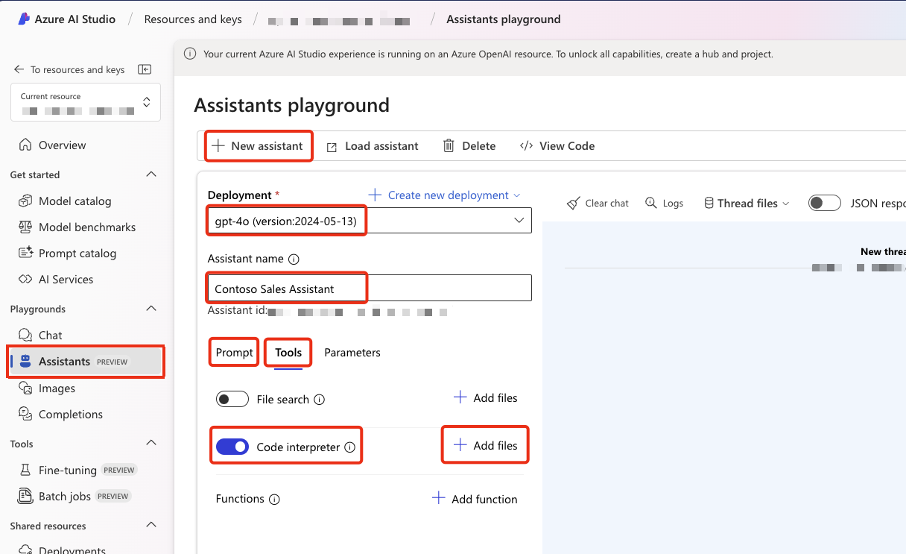

# Explore Contoso Retail Data

In this demo, we will use the Azure AI Studio Assistants API (Preview) Playground to explore Contoso sales data. The data, stored in a CSV file that you will upload to the playground, includes details on sales revenue by region, category, product type, year, and month. The objective is to demonstrate how to use the AI Studio Assistants Playground for analyzing and visualizing this data with the Assistants API Code Interpreter.

## Prerequisites

To successfully follow this demo, you will need the following resources:

- An Azure subscription
- Access to the Azure AI Studio Assistants API (Preview) Playground
- The Contoso Retail data CSV file (found in the data folder)
- An OpenAI model deployment; as of August 2024, it is recommended to use GPT-4o

## How to Create a New Assistant

The following steps will guide you through the process of creating an assistant in the Azure AI Studio Assistants API (Preview) Playground and uploading the Contoso Retail data CSV file. The areas highlighted in red are the key areas to focus on when setting up the assistant.



1. Open your browser and navigate to Azure AI Studio.
1. From the left menu, select Assistants.
1. Click on + New Assistant to create a new assistant.
1. Select Deployment, and choose GPT-4o.
1. Name the assistant Contoso Sales Assistant.
1. Select the Prompt section and copy and paste the following text:

   ```text
   You are a sales analysis assistant for Contoso. Please be polite, professional, helpful, and friendly.

   You get all the sales data from the uploaded csv files. There is sales revenue data that is broken down region, product category, product type and split out by year and month.

   Examples of regions include Africa, Asia, Europe and America. Categories include climbing gear, camping equipment, apparel and more. Product categories include jackets, hammocks, wet suites, crampons, shows and more.

   If a question is not related to sales or you cannot answer the question, say, 'contact IT for more assistance.'. If the user asks for help or says 'help', provide a list of sample questions that you can answer.
   ```

1. Select **Tools** and enable **Code Interpreter**.
1. Select the adjacent **+Add files** and upload the **Contoso_Sales_Revenue_By_Regon_By_Category_By_Product_Type_By_Year_Month.csv** file from the data folder.

## How to Load an Existing Assistant

1. Open your browser and navigate to [Azure AI Studio](https://ai.azure.com).
2. From the left menu, select **Assistants**.
3. Click on the **Load Assistant** button.
4. Choose the **Contoso Sales Assistant** from the list.

## Introduction to the Demo

The purpose of this demo is to demonstrate how to utilize the AI Studio Assistants Playground for data analysis and visualization using the Assistants API Code Interpreter. In this interactive session, the user will direct the conversation, and the assistant will provide answers and visualizations accordingly.

As part of the process, the model will interpret the conversation and dynamically generate code to respond to user questions. This code is then executed by the Code Interpreter, with the results displayed in the chat window.

Before advancements in AI-driven user experiences, users had to manually write code to analyze and visualize data. The AI Studio Assistants Playground revolutionizes this process by enabling users to ask questions in natural language, allowing the assistant to generate the required code for data analysis and visualization.

Currently, the AI Studio Assistants Playground offers two tools: the Code Interpreter and File Search. The File Search tool facilitates file uploads and supports both keyword and semantic searches for Retrieval-Augmented Generation (RAG) style interactions.

For this demo, the focus will be on the Code Interpreter, which is specifically designed to write and execute code for data analysis and visualization.

## Why is the Code Interpreter so interesting?

Large Language Models (LLMs) excel at interpreting and generating natural language text. While they may not be particularly strong in directly performing mathematical operations, they are highly proficient in writing code to handle calculations, generate charts, create visualizations, and more. The Code Interpreter is a feature that enables LLMs to produce and execute code in real-time to answer queries and perform computational tasks.

## Start the conversation

Below is an example conversation flow. Note that, due to the nature of the AI model, the conversation may not unfold exactly as shown:

## Sample Conversation Flow

1. Clear any existing chat history.
1. `help`

   - Help uses the assistant instructions to establish the context of the conversation and provides a list of sample questions that the assistant can answer.

   

1. `list all the regions`

   - This includes the regions available in the CSV data into the context of the conversation.

   

1. `what are the total sales for asia broken down by category`

   

1. `show as a bar chart of sales`

   

1. `show me the top 5 selling products by region`

   

1. `what are all the product types`

   - This incorporates the product types from the CSV data into the conversation, improving the AI's understanding of product types and their relationships. This capability will be demonstrated in the next question about ski-related equipment.

   

1. `Can you show a stacked bar chart of sales of ski related equipment by region.`

   

1. `What products are related to skiing\*\*

   

1. `I want to download an excel doc for sales of skiing related equipment by region`

   

## What We Learned

Throughout the demo, we learned how to utilize the Azure AI Studio Assistants API (Preview) Playground to analyze and visualize Contoso sales data stored in a CSV file. Below are some key takeaways:

### Setting Up the Environment

1. **Prerequisites**: Before starting, ensure you have an Azure subscription, access to the Azure AI Studio Assistants API (Preview) Playground, the Contoso Retail data CSV file, and an OpenAI model deployment, preferably GPT-4o.

2. **Creating a New Assistant**:

   - Navigate to Azure AI Studio and create a new assistant.
   - Select the Deployment option and choose GPT-4o.
   - Name the assistant "Contoso Sales Assistant."
   - Input a specific prompt to define the assistant's role.
   - Enable the Code Interpreter tool and upload the Contoso sales data CSV file.

3. **Loading an Existing Assistant**:
   - You can also load pre-existing assistants from the Assistants menu in Azure AI Studio.

### Interactive Data Analysis and Visualization

1. **Conversational Guidance**: The user can direct the conversation, and the assistant provides answers and visualizations based on the data.
2. **Dynamic Code Generation**: The model interprets the conversation and dynamically generates code to respond to queries, executing it via the Code Interpreter.
3. **Natural Language Queries**: Users can pose questions in natural language, significantly simplifying the process of data analysis and visualization.
