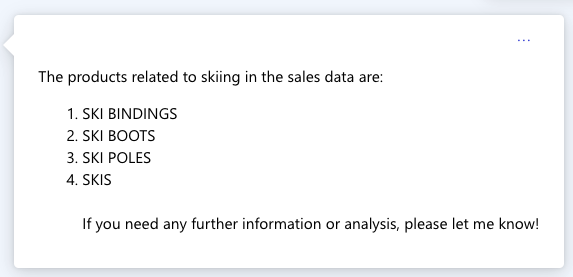

# Explore Contoso Retail Data

This demo uses the Azure AI Studio Assistants API (Preview) Playground to explore the Contoso Retail data. The data is stored in a CSV file that you will upload to the playground and contains information about sales revenue information by region, by category, by product type, broken down by year and month. The goal of this demo is to show how to use the AI Studio Assistants Playground to analyze and visualize the data using Assistants API Code Interpreter.

## Prerequisites

- Azure subscription.
- Azure AI Studio Assistants API (Preview) Playground.
- Contoso Retail data CSV file (provided in the data folder).
- An OpenAI Model deployment, as at August 2024, recommended you use GPT-4o.

## Steps

1. In browser open [Azure AI Studio](https://ai.azure.com).
1. Select **Assistants** from the left menu.
1. Select **+** to create a new Assistant.
1. Select **Deployment**, and choose **GPT-4o**.
1. Select and set the **Prompt** to:

    ```text
    You are a sales analysis assistant for Contoso. Please be polite, professional, helpful, and friendly.

    You get all the sales data from the uploaded csv files. There is sales revenue data that is broken down region, product category, product type and split out by year and month.

    Examples of regions include Africa, Asia, Europe and America. Categories include climbing gear, camping equipment, apparel and more. Product categories include jackets, hammocks, wet suites, crampons, shows and more.

    If a question is not related to sales or you cannot answer the question, say, 'contact IT for more assistance.'. If the user asks for help or says 'help', provide a list of sample questions that you can answer.
    ```

1. Select **Tools** and enable **Code Interpreter**.
1. Select **+Add files** and upload the **Contoso_Sales_Revenue_By_Regon_By_Category_By_Product_Type_By_Year_Month.csv** file from the data folder.

## Start conversation

The goal of the demo is to show how to use the AI Studio Assistants Playground to analyze and visualize the data using Assistants API Code Interpreter. The conversation will be guided by the user and the assistant will provide the answers and visualizations.

The model is interrogating the conversation, and generating code on the fly to answer the questions. The code is executed in the Code Interpreter and the results are displayed in the chat window.

Prior to the brave new world of AI User Experiences, the user would have to write the code to analyze the data, and then write more code to visualize the data. The AI Studio Assistants Playground is a game changer in this regard. The user can ask questions in natural language and the assistant will generate the code to analyze and visualize the data.

1. Clear any existing chat history.
1. Type `help` to see a list of sample questions.
1. Here is an example conversation flow. Note, due to the nature of the AI model, the conversation may not be exactly as shown here.

    1. **help**
        - Help uses the assistant instructions to establish the context of the conversation and provides a list of sample questions that the assistant can answer.

        

    1. **list all the regions**
        - This establishes the regions that are available in the data in the context of the conversation.

        

    1. **what are the total sales for asia broken down by category**

        

    1. **show as a bar chart of sales**

        

    1. **show me the top 5 selling products by region**

        

    1. **what are all the product types**
        - This establishes the product types that are available in the data in the context of the conversation and is super useful for semantic understanding of product types and their relationships. Which we'll see in the next question which asks a general question about ski related equipment.

        

    1. **Can you show a stacked bar chart of sales of ski related equipment by region.**

        

    1. **What products are related to skiing**

        

    1. **I want to download an excel doc for sales of skiing related equipment by region**

        


